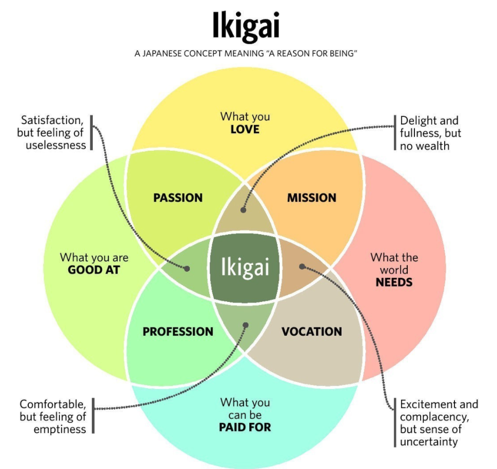

`ikigai` 是一个日本的词语，含义是“生活的目的”，其对我们的参考主要是对于工作、人生的选择：

工作主要由四个维度组成：金钱（被支付），擅长，热爱，被别人所需要。这四点我认为将主观的、客观的；人性利己、利他的部分都包含。倒是挺符合我心中所想。

找寻四个方面交叉的地方的确很难，但也给我们一个检查当下自己不幸福的思路。另外自己听闻了一个`心流`的概念，它描述的是，当自己做某一件事情的时候，完全的专注、投入的状态。当做这种事情的时候，内在驱动力驱使着我们前进，因为热爱，所以不感觉到疲惫。回想自己之前，也体会到这种专注的状态，但都是在读书的时候有这种状态。

人生一世，能够找到自己热爱的东西，并且有回报真是一件幸运的事情。事情是可以改变的，希望自己能够多多尝试，目前主要找寻的方向是热爱和擅长的东西。